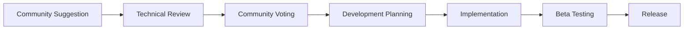

# Contributing to AI Code Assistant Pro

Welcome to the AI Code Assistant Pro community! 🐝✨ We're excited to have you contribute to our growing family of AI personalities.

## 🎯 Quick Start for Contributors

1. **Star the Repository** ⭐ - Show your support!
2. **Read our Roadmap** 📋 - Check the README.md for expansion plans (5 → 10+ personalities)
3. **Join Discussions** 💬 - Share ideas in GitHub Discussions
4. **Submit Issues** 🐛 - Use our detailed issue templates

## 🤖 AI Personality Development

Our expansion from 5 to 10+ AI personalities is community-driven! Here's how you can help:

### Current Personalities (v1.0)
- **🐝 Buzzy** - Performance optimization specialist
- **🔨 Builder** - Architecture and system design expert
- **🔍 Scout** - Code analysis and pattern recognition
- **🛡️ Guardian** - Security and best practices enforcer
- **✨ Spark** - Innovation and creative problem-solving

### How to Suggest New Personalities

1. **Use the Template**: File a "🤖 AI Personality Suggestion" issue
2. **Be Specific**: Include capabilities, commands, and use cases
3. **Community Vote**: Engage with others' suggestions
4. **Beta Testing**: Volunteer to test new personalities

### Personality Development Process



## 📋 Types of Contributions

### 🐛 Bug Reports
- Use the bug report template
- Include VS Code version, extension version, and steps to reproduce
- Test with minimal reproduction case

### ✨ Feature Requests
- Use the feature request template
- Explain the problem and proposed solution
- Consider how it fits with existing personalities

### 📚 Documentation
- Improve installation guides
- Add usage examples
- Translate documentation
- Fix typos and formatting

### 🔧 Code Contributions
- Follow TypeScript best practices
- Maintain consistency with existing code style
- Add appropriate tests
- Update documentation

## 🚀 Development Setup

### Prerequisites
- Node.js 16+ and npm
- Visual Studio Code
- Git

### Setup Steps
```bash
# Clone the repository
git clone https://github.com/HOME-OFFICE-IMPROVEMENTS-LTD/ai-code-assistant-pro.git
cd ai-code-assistant-pro

# Install dependencies
npm install

# Open in VS Code
code .

# Start development
npm run watch
```

### Testing Your Changes
```bash
# Compile TypeScript
npm run compile

# Run tests
npm test

# Package for testing
npx vsce package

# Test in VS Code
# Press F5 to launch Extension Development Host
```

## 📝 Coding Standards

### TypeScript Guidelines
- Use strict type checking
- Prefer interfaces over type aliases for objects
- Use async/await over Promises
- Document public APIs with JSDoc

### File Structure
```
src/
├── personalities/          # AI personality implementations
├── commands/              # VS Code command handlers
├── providers/             # Language service providers
├── utils/                 # Utility functions
└── extension.ts           # Main extension entry point
```

### Code Style
- Use 2 spaces for indentation
- Use semicolons
- Use single quotes for strings
- Use camelCase for variables and functions
- Use PascalCase for classes and interfaces

## �� Pull Request Process

### Before Submitting
1. **Create an Issue**: Discuss major changes first
2. **Fork the Repository**: Work in your own fork
3. **Create Feature Branch**: `git checkout -b feature/your-feature-name`
4. **Test Thoroughly**: Ensure all tests pass
5. **Update Documentation**: Keep docs in sync with changes

### PR Requirements
- [ ] Clear description of changes
- [ ] Link to related issue(s)
- [ ] Tests added/updated
- [ ] Documentation updated
- [ ] No breaking changes (or clearly documented)
- [ ] Code follows style guidelines

### PR Template
When creating a PR, please include:

```markdown
## Description
Brief description of changes

## Type of Change
- [ ] Bug fix
- [ ] New feature
- [ ] Breaking change
- [ ] Documentation update

## Testing
- [ ] Tested in VS Code Extension Development Host
- [ ] All existing tests pass
- [ ] New tests added for new functionality

## Related Issues
Fixes #123

## Screenshots (if applicable)
Add screenshots for UI changes
```

## 🏢 Enterprise & Community Balance

We maintain a balance between community-driven development and enterprise needs:

### Community Priority
- Open source development
- Community-requested personalities
- Transparent roadmap
- Public discussions

### Enterprise Features
- Advanced configuration options
- Enterprise-specific personalities
- Priority support
- Custom integrations

## 🎖️ Recognition

### Contributor Levels
- **🌟 Community Champion**: Regular contributor with significant impact
- **🤖 Personality Creator**: Successfully contributed new AI personality
- **📚 Documentation Hero**: Major documentation improvements
- **🛡️ Security Guardian**: Responsible security disclosure
- **🐛 Bug Hunter**: Multiple high-quality bug reports

### Hall of Fame
Contributors are recognized in:
- README.md contributors section
- Release notes
- Community recognition program
- Exclusive beta access

## 📞 Getting Help

### Communication Channels
- **GitHub Issues**: Bug reports and feature requests
- **GitHub Discussions**: General questions and ideas
- **Email**: info@hoiltd.com for complex issues
- **Security Issues**: info@hoiltd.com (see SECURITY.md)

### Response Times
- **Bug Reports**: 48-72 hours
- **Feature Requests**: 1 week
- **Security Issues**: 24-48 hours
- **General Questions**: 48-72 hours

## 🎉 Community Events

### Monthly Community Calls
- Roadmap updates
- New personality previews
- Community feedback sessions
- Technical deep-dives

### Contribution Sprints
- Quarterly focused development periods
- Community-driven feature development
- Documentation improvements
- Testing campaigns

## 📜 Code of Conduct

### Our Standards
- Be respectful and inclusive
- Focus on constructive feedback
- Help others learn and grow
- Maintain professional communication

### Unacceptable Behavior
- Harassment or discrimination
- Inappropriate content
- Spam or self-promotion
- Disruptive behavior

### Enforcement
Violations may result in:
1. Warning
2. Temporary ban
3. Permanent ban

Report issues to: info@hoiltd.com

## 📊 Project Stats & Transparency

### Current Metrics
- **Active Contributors**: [Updated monthly]
- **Community Issues**: [Updated weekly]
- **Development Velocity**: [Updated per release]
- **User Adoption**: [Updated monthly]

### Roadmap Transparency
- Public roadmap in README.md
- Community voting influence
- Clear development priorities
- Regular progress updates

---

## 🚀 Ready to Contribute?

1. **Start Small**: Fix a typo, improve documentation
2. **Join Discussions**: Share your ideas and feedback
3. **Report Bugs**: Help us improve quality
4. **Suggest Personalities**: Shape our AI worker family
5. **Code Contributions**: Implement new features

**Thank you for helping build the future of AI-powered development tools!** 🐝✨

---

*This contributing guide is a living document. Suggest improvements via issues or PRs.*

**Last Updated**: June 2025
